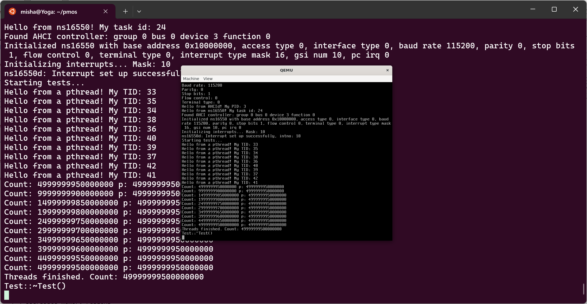
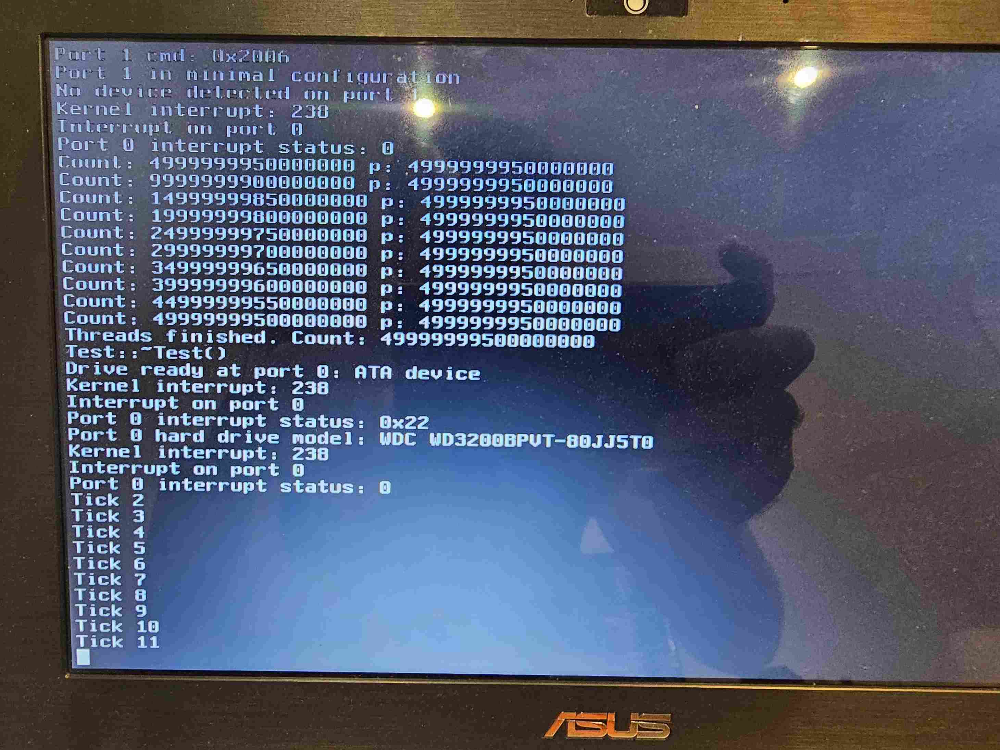

# pmOS

A small (hobby) operating for x86_64 and RISC-V, using a homemade microkernel, C library and userspace, partially developed as my end of degree project. The goal of the project is to make a general purpose operating system, with the objective of learning and being suitable for development and exploration of the RISC-V and X86 platforms. The microkernel is mostly written in C++, and the userspace is in a mixture of C and C++ (and ASM where needed). The [limine bootloader](https://limine-bootloader.org/) is used for booting the system.

## Screenshots
RISC-V Execution:

Baremetal execution on an old x86 (AMD E450) laptop, discovering an internal SATA HDD:

## Architecture

The OS is based on a microkernel architecture, with the idea of running drivers and services in userspace. The kernel currently has physical and virtual memory managers, scheduling, interrupts, IPC and permissions managed inside it. Of the process management, the kernel only knows about threads (called "tasks" in the code), with (POSIX) processes and threads being an abstraction on top of it, managed in userspace. The rest is implemented in userspace, communicating through IPC message queues.

The executables use ELF format.

The system supports booting by the limine protocol. In the past, multiboot2 was used with a stage 2 bootloader, but it was replaced by limine, since it works on both x86_64 and RISC-V. The kernel is loaded by limine, which initializes itself and starts the first user space task from a module called "bootstrap". It then recieves some info from the kernel and list of modules, moved to memory objects and starts those up, and maps itself as a root filesystem.

As such, the `kernel` directory contains the kernel, the `lib` contains userspace C libraries, `sysroot` contains system headers, `limine` contains the bootloader configs, and the rest of the directories contain different userspace programs, which make up the system. All of the drivers (including framebuffer) are run in userspace.

## Compilation and execution

The patched LLVM infrastructure (clang compiler and lld linker), targeting pmOS, is used for both the kernel and userspace. Before that, GCC and binutils were used, which probably still work, but I haven't been using/testing them. The build scritps expect to see the clang binaries targeting pmOS in the PATH. The ARCH environment variable controls the target architecture of build scripts (riscv64 or x86_64).

The patched clang sources can be obtained from [https://gitlab.com/mishakov/llvm-pmos](https://gitlab.com/mishakov/llvm-pmos). The [https://llvm.org/docs/CMake.htm](https://llvm.org/docs/CMake.html) is an documentation for compiling LLVM.

To compile the project, the following steps should be followed:
1. Compile clang and lld from source
2. Prepare the sysroot by executing `make sysroot` in the root of the project tree. Compile C libraries, executing `make lib` in the root of the project tree (this is necessary to link C++ libraries)
3. Compile llvm runtimes (libcxx, libcxxabi, libunwind)
4. Compile the rest of the system with `make all`

After that, the output iso is produced in limine/pmOS.iso. The build script downloads and packages limine into iso when running the last step (`make all`). To run QEMU, use `make qemu` for RISC-V and `make qemu-x86` for x86.

The following shorthands can be used to configure to configure llvm and runtimes:
- `cmake -S ../llvm-pmos/llvm  -DCMAKE_BUILD_TYPE=Release -DLLVM_ENABLE_PROJECTS="clang;lld;lldb" -DLLVM_TARGETS_TO_BUILD="X86;RISCV" -DCMAKE_INSTALL_PREFIX=$HOME/cross/ -DLLVM_HOST_TRIPLE=x86_64-linux-gnueabihf -DLLVM_TARGET_TRIPLE=x86_64-pmos -DCLANG_DEFAULT_CXX_STDLIB=libc++ -DCLANG_DEFAULT_LINKER=lld` - configures clang and lld for RISC-V and x86, assuming `$HOME/cross` destination (you can then use `export PATH=$HOME/cross/bin:$PATH` to add them to the PATH)
- `cmake -S ../llvm-pmos/runtimes -DLLVM_ENABLE_RUNTIMES="libcxx;libcxxabi;libunwind;compiler-rt"  -DCMAKE_BUILD_TYPE=Release -DCMAKE_INSTALL_PREFIX=$HOME/pmos/sysroot/usr/ -DLLVM_TARGET_TRIPLE=x86_64-pmos -DCMAKE_CXX_COMPILER_TARGET="x86_64-pmos" -DCMAKE_C_COMPILER="clang" -DCMAKE_CXX_COMPILER="clang++" -DCMAKE_C_COMPILER_TARGET="x86_64-pmos" -DCMAKE_ASM_COMPILER_TARGET="x86_64-pmos" -DCOMPILER_RT_BUILD_BUILTINS=ON -DCMAKE_C_FLAGS="--sysroot=$HOME/pmos/sysroot -nostartfiles" -DCMAKE_CXX_FLAGS="--sysroot=$HOME/pmos/sysroot" -DLIBCXXABI_USE_LLVM_UNWINDER=true -DLIBCXX_ENABLE_SHARED=OFF -DLIBUNWIND_ENABLE_SHARED=OFF -DLIBCXXABI_ENABLE_SHARED=OFF  -DCOMPILER_RT_BUILD_BUILTINS=ON -DCOMPILER_RT_BUILD_LIBFUZZER=OFF -DCOMPILER_RT_BUILD_MEMPROF=OFF -DCOMPILER_RT_BUILD_PROFILE=OFF -DCOMPILER_RT_BUILD_SANITIZERS=OFF -DCOMPILER_RT_BUILD_XRAY=OFF -DCOMPILER_RT_INSTALL_LIBRARY_DIR="$HOME/pmos/sysroot/usr/lib"` - configures llvm runtimes for x86 (replace x86_64 with risc64 for RISC-V), assuming `$HOME/pmos/sysroot` the sysroot, installing the headers and libraries into `$HOME/pmos/sysroot/usr`.

## Immediate plans

1. Implement working set for virtual memory (swap and page replacement)
2. Implement AHCI driver reading and writing
 - Work on doccumentation
 - Improve project structure

## Features

These are the features that are planned to be had in the OS:

### Kernel

#### Arch-independent features:
- [ ] Processes and threads
  - [ ] Processes - The kernel has tasks, but POSIX processes and execlp/spawn is not yet implemented
  - [x] Task switching
  - [x] Preemptive multitasking
  - [X] Threads - basic pthread implementation in userspace building on kernel interfaces
  - [X] Kernel threads
  - [x] User space

- [ ] Memory
  - [x] Page frame allocator
  - [x] Kernel virtual memory manager
  - [x] kmalloc
  - [x] Allocating memory to userspace
  - [x] Userspace memory regions
    - [x] Mapping (anonymous mmap)
    - [x] Lazy allocations
    - [x] Full unmapping
    - [x] Partial and overlaping unmapping (munmap)
    - [ ] memprotect and changing permissions
    - [x] Acccess to physical memory
    - [x] Mapping of memory objects
    - [x] Copy-on-write
  - [x] Memory mapping
  - [x] Releasing used pages
  - [ ] Memory objects
    - [x] Memory object creation from kernel
    - [x] Memory object access from kernel
    - [ ] Blocking tasks on memory object access in kernel
      - Need to make changes in scheduler
    - [x] Memory object mapping to userspace
    - [x] Memory object creation and management from userspace
  - [x] Delayed allocation
  - [x] Memory protections
  - [x] TLB shootdowns
  - [ ] Swapping
  - [x] Accessing userspace memory
    - Implemented (and surprisingly works well), but is very slow, needs rewriting

- [ ] Interrupts and exceptions
  - [x] Very basic exception handling
  - [x] Syscalls
  - [x] Interrupt dispatching to drivers
  - [ ] Interrupt sharing

- [x] IPC and messaging
  - [x] Buffered string messages
  - [x] Ports
  - [x] Kernel messages
  - [ ] Quicker messaging
  
- [ ] Permissions
- [x] Multi CPU support

#### RISC-V specific features:

- [x] Virtual memory
- [x] Exceptions
- [x] Timer interrupt
- [x] Userspace/U mode
- [x] Multi hart support

#### x86_64 specific features:

- [x] Virtual memory
- [x] Exceptions
- [x] Timer interrupt
- [x] LAPIC
- [x] Userspace/Ring 3
- [x] Multi CPU support

**Core utilities and daemons**
- [ ] Process management (processd) - Mostly unfinished, I plan it to route signals
- [ ] Networking (networkd)
- [ ] Filesystems
  - [ ] FAT32
  - [ ] FUSE
  - [ ] USTAR filesystem daemon - Archive parsing works, but it is very incomplete
  - [ ] VFSd
    - [X] Mounting filesystems
    - [X] Opening files
    - [X] Traversing trees
- [ ] Drawing on screen (screend)
  - [x] Framebuffer
    - [x] Showing text with framebuffer
- [ ] Human input
- [X] Native executables
- [ ] POSIX compatibility layer - Many functions are implemented and working, but a lot more are yet to be done

**Drivers**
- [X] PS/2
  - [ ] Keyboard - was working, but is now broken after porting to RISC-V
  - [ ] Mouse
- [ ] i8042
  - Broken after porting to RISC-V
- [ ] ATA/Bulk storage
  - [ ] AHCI
    - [X] Controller detection and initialization
    - [X] Device detection
    - [X] DMA
    - [X] interrupts handling
    - [ ] Reading and writing - Want to implement working set first to read directly to kernel cache
    - [ ] NVMe
- [ ] USB
- [X] Serial/Parallel - ns16550 using interrupts for receiving and sending. Works on RISC-V, missing IO ports stuff and untested on x86.
- [X] PCI/PCIe
  - [x] Device detection
  - [x] Legacy interrupt routing - Works on x86, broken on RISC-V, likely easy to fix
  - [ ] MSI/MSI-X
- [ ] Network cards
- [ ] virtio
  - [ ] virtio-user-input
- [X] ACPI (using uACPI)
  - [X] Initialization
  - [X] IRQ routing
  - [X] Power button (interrupt) and shutting down
  - [X] EC driver
  - [X] AMG GPIO driver

**Userland**
- [ ] Terminal
- [ ] GUI
- [ ] C/POSIX Library - a buch of functions are implemented, but a lot more are missing

**Languages/Runtimes**
- [X] LLVM/Clang patch
- [X] Hosted GCC cross-compiler
- [X] C and its runtime (using homemade C/POSIX library)
- [X] C++ and libstdc++ (and other) runtime(s) - Compiling and working but a lot of C library functions are missing
- [X] Go and libgo runtime with GCC - Compiling, but untested and probably broken for now. Also, exec-stuff is missing

## Known issues

## Documentation

In works!

## Dependencies

The following libraries have been used in the project, possibly containing their own licenses:
- [libunwind](/kernel/libunwind/)
- [libcxxrt](/kernel/libcxxrt/)
- [smoldtb](/kernel/smoldtb/)
- [flanterm](/terminald/flanterm/)
- dlmalloc in libc and kernel
- [uACPI](/devicesd/generic/uACPI/)

## License

Unless otherwise stated (see the dependencies), the project is licensed under the BSD 3-Clause license. See the [LICENSE](LICENSE) file for more information.