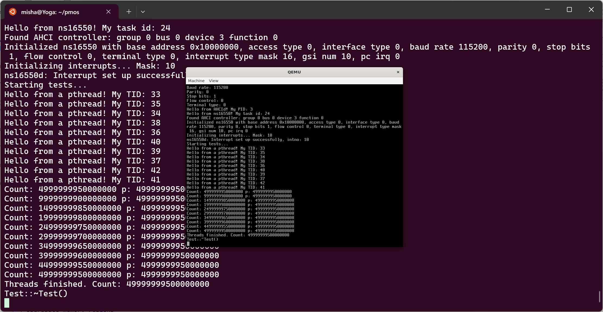
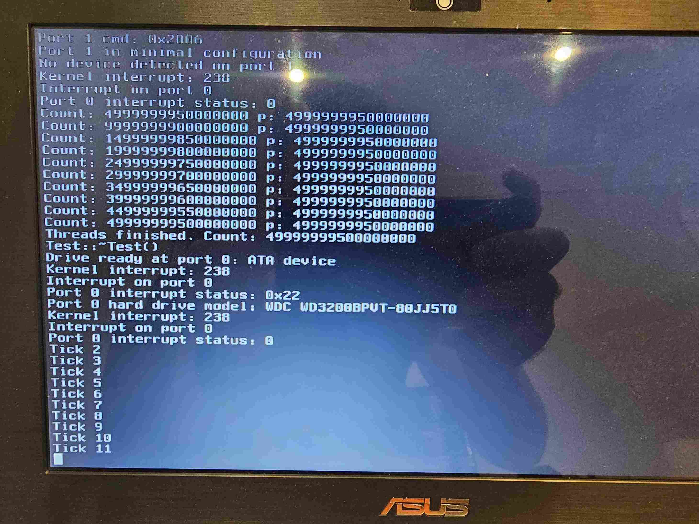

# pmOS

A small (hobby) operating for RISC-V, LoongArch and x86 (i686 and x86_64), using a homemade microkernel, C library and userspace, partially developed as my end of degree project. The goal of the project is to make a general purpose operating system, with the objective of learning and being suitable for development and exploration of the RISC-V and X86 platforms. The microkernel is mostly written in C++, and the userspace is in a mixture of C, C++ and Rust (and ASM where needed). The [limine bootloader](https://limine-bootloader.org/) and [Hyper bootloader](https://github.com/UltraOS/Hyper) are used for booting the system, depending on the architecture.

## Screenshots
RISC-V Execution:


Baremetal execution on an old x86 (AMD E450) laptop, discovering an internal SATA HDD:


## Architecture

The OS is based on a microkernel architecture, with the idea of running drivers and services in userspace. The kernel currently has physical and virtual memory managers, scheduling, interrupts, IPC and permissions managed inside it. Of the process management, the kernel only knows about threads (called "tasks" in the code), with (POSIX) processes and threads being an abstraction on top of it, managed in userspace. The rest is implemented in userspace, communicating through IPC message queues.

The executables use ELF format.

The system supports booting by the limine protocol. In the past, multiboot2 was used with a stage 2 bootloader, but it was replaced by limine, since it works on both x86_64 and RISC-V. The kernel is loaded by limine, which initializes itself and starts the first user space task from a module called "bootstrap". It then recieves some info from the kernel and list of modules, moved to memory objects and starts those up, and maps itself as a root filesystem.

As such, the `kernel` directory contains the kernel, the `lib` contains userspace C libraries, `sysroot` contains system headers, `limine` contains the bootloader configs, and the rest of the directories contain different userspace programs, which make up the system. All of the drivers (including framebuffer) are run in userspace.

The i686 port is using [Hyper](https://github.com/UltraOS/Hyper) bootloader and its Ultra protocol.

## Compilation and execution

The [Jinx build system](https://codeberg.org/Mintsuki/jinx) is used for building the system. A Makfile is provided in the root of this project, which downloads Jinx and uses it to build the system images for different architectures. The `qemu`, `qemu-x86` and `qemu-loongarch64` makefile targets are provided to build and run RISC-V, x86 and LoongArch64 images in qemu, respectively.

If you would like to use jinx directly, you can run
```sh
export source_dir=<path to this repository>

cd ${source_dir} && git submodule update --init --recursive # Prepare submodules
make -C ${source_dir} jinx # Download jinx

cd <your build directory>
${source_dir}/jinx init ${source_dir} ARCH=<desired architecture, e.g. riscv64, x86_64, i686, loongarch64>
${source_dir}/jinx build
```

## Immediate plans

1. Implement working set for virtual memory (swap and page replacement)
2. Implement AHCI driver reading and writing
 - Work on doccumentation
 - Improve project structure

## Features

These are the features that are planned to be had in the OS:

### Kernel

#### Arch-independent features:
- [ ] Processes and threads
  - [ ] Processes - The kernel has tasks, but POSIX processes and execlp/spawn is not yet implemented
  - [x] Task switching
  - [x] Preemptive multitasking
  - [X] Threads - basic pthread implementation in userspace building on kernel interfaces
  - [X] Kernel threads
  - [x] User space

- [ ] Memory
  - [x] Page frame allocator
    - [x] Zone allocator - currently only splits memory into <4GB and >=4GB zones (for legacy devices)
  - [x] Kernel virtual memory manager
  - [x] kmalloc
  - [x] Allocating memory to userspace
  - [x] Userspace memory regions
    - [x] Mapping (anonymous mmap)
    - [x] Lazy allocations
    - [x] Full unmapping
    - [x] Partial and overlaping unmapping (munmap)
    - [ ] memprotect and changing permissions
    - [x] Acccess to physical memory
    - [x] Mapping of memory objects
    - [x] Copy-on-write
  - [x] Memory mapping
  - [x] Releasing used pages
  - [ ] Memory objects
    - [x] Memory object creation from kernel
    - [x] Memory object access from kernel
    - [ ] Blocking tasks on memory object access in kernel
      - Need to make changes in scheduler
    - [x] Memory object mapping to userspace
    - [x] Memory object creation and management from userspace
  - [x] Delayed allocation
  - [x] Memory protections
  - [x] TLB shootdowns
  - [ ] Swapping
  - [x] Accessing userspace memory
    - Implemented (and surprisingly works well), but is very slow, needs rewriting

- [ ] Interrupts and exceptions
  - [x] Very basic exception handling
  - [x] Syscalls
  - [x] Interrupt dispatching to drivers
  - [ ] Interrupt sharing

- [x] IPC and messaging
  - [x] Buffered string messages
  - [x] Ports
  - [x] Kernel messages
  - [x] Quick user memory access - catching exceptions on userspace memory access
  - [x] Handles/capabilities - would make API a lot nicer and fix a lot of issues with current design
    - [x] Handles for ports
    - [ ] Handles for other stuff
    - [ ] Notification of closed handles
  
- [ ] ~~Permissions~~ -> capabilities would solve that
- [x] Multi CPU support

#### RISC-V specific features:

- [x] Virtual memory - 3 to 5 level page tables
- [x] Exceptions
- [x] Timer interrupt
- [x] Userspace/U mode
- [x] Multi hart support

#### x86 features:
- [x] Virtual memory
- [x] Exceptions
- [x] Time
  - [x] ACPI PM Timer (clock source and calibration)
  - [x] HPET (clock source and calibration)
    - [ ] HPET timer interrupt source (in absence of LAPIC timer)
  - [x] LAPIC timer
  - [x] TSC
  - [x] TSC deadline
  - [x] KVM clock
- [ ] APIC
  - [x] xAPIC
  - [x] x2APIC
  - [x] LAPIC
  - [ ] IOMMU
- [x] Userspace/Ring 3
- [x] Multi CPU support

#### x86_64 specific features:
- [ ] 5 level paging

#### i686 specific features:

- [x] Virtual memory
  - [x] 2 level page tables
  - [x] PAE - supports and uses up to 16GB of RAM, if available

#### LoongArch64 specific features:
- [x] Virtual memory
- [x] Exceptions
- [x] Timer interrupt - haven't noticed there was a TSC-like global timer, needs fixing
- [x] External interrupts - using EIO PIC and BIO PIC over HT
- [x] Userspace
- [ ] Multi CPU support


**Core utilities and daemons**
- [ ] Process management (processd) - Mostly unfinished, I plan it to route signals
- [ ] Networking (networkd)
- [ ] Filesystems
  - [ ] FAT32
  - [ ] FUSE
  - [ ] USTAR filesystem daemon - Archive parsing works, but it is very incomplete
  - [ ] VFSd
    - [X] Mounting filesystems
    - [X] Opening files
    - [X] Traversing trees
- [ ] pmbus - a bus for drivers and services in Rust
  - [x] Publishing objects
  - [x] Requesting objects
  - [x] C++ bindings
  - [x] C bindings
  - [ ] Rust bindings
- [ ] Drawing on screen (screend)
  - [x] Framebuffer
    - [x] Showing text with framebuffer
- [ ] Human input
- [X] Native executables
- [ ] POSIX compatibility layer - Many functions are implemented and working, but a lot more are yet to be done

**Drivers**
- [X] PS/2
  - [X] Keyboard - works, but needs something to funnel the input to
  - [ ] Mouse
- [X] i8042
- [ ] ATA/Bulk storage
  - [ ] AHCI
    - [X] Controller detection and initialization
    - [X] Device detection
    - [X] DMA
    - [X] interrupts handling
    - [X] Reading
    - [ ] Writing - no filesystems yet
  - [ ] NVMe
  - [ ] Virtio block
- [ ] USB
- [X] Serial/Parallel - ns16550 using interrupts for receiving and sending. Works on RISC-V, missing IO ports stuff and untested on x86.
- [X] PCI/PCIe
  - [x] Device detection
  - [x] Legacy interrupt routing - Works on x86, broken on RISC-V, likely easy to fix
  - [ ] MSI/MSI-X
- [ ] Network cards
- [ ] virtio
  - [ ] virtio-user-input
- [X] ACPI (using uACPI)
  - [X] Initialization
  - [X] IRQ routing
  - [X] Power button (interrupt) and shutting down
  - [X] EC driver
  - [X] AMD GPIO driver
  - [ ] S3 sleep - kinda works, but doesn't have a proper interface for drivers


**Userland**
- [ ] Terminal
- [ ] GUI
- [ ] C/POSIX Library - a buch of functions are implemented, but a lot more are missing
- [ ] Init server
  - [x] Launching servers
  - [x] Matching pmbus objects

**Languages/Runtimes**
- [X] LLVM/Clang patch
- [X] Hosted GCC cross-compiler
- [X] C and its runtime (using homemade C/POSIX library)
- [X] C++ and libstdc++ (and other) runtime(s) - Compiling and working but a lot of C library functions are missing
- [X] Go and libgo runtime with GCC - Compiling, but untested and probably broken for now. Also, exec-stuff is missing

## Known issues

## Documentation

In works!

## Dependencies

The following libraries have been used in the project, possibly containing their own licenses:
- [smoldtb](/kernel/smoldtb/)
- [flanterm](/terminald/flanterm/)
- dlmalloc in libc and kernel
- [uACPI](/devicesd/generic/uACPI/)

## License

Unless otherwise stated (see the dependencies), the project is licensed under the BSD 3-Clause license. See the [LICENSE](LICENSE) file for more information.